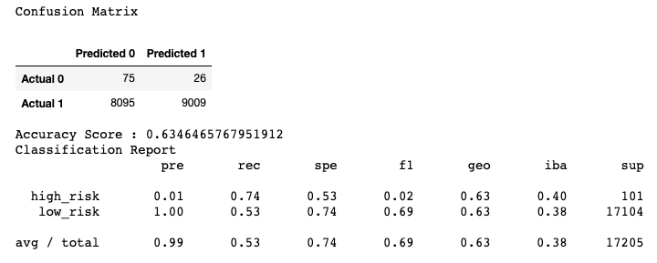
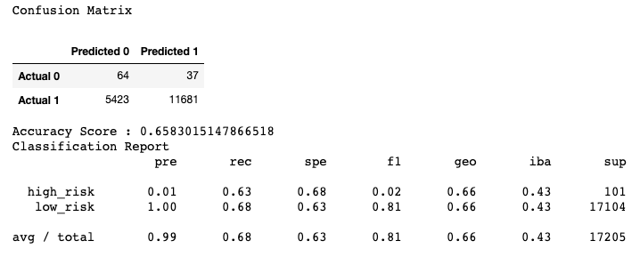
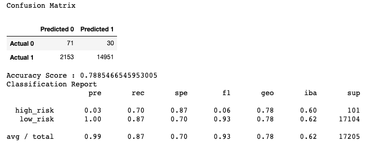
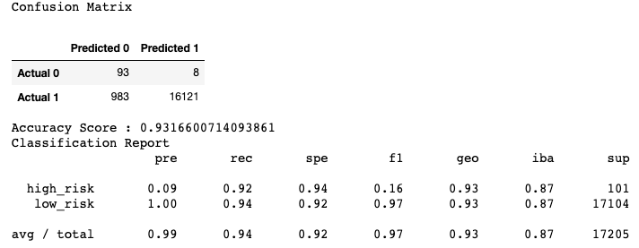

# Credit Risk Analysis

## Overview of Project
This project makes use of machine learning algorithms to predict credit risk based on credit card data from the Lending Club, a peer-to-peer lending services company and use of the imbalanced-learn and scikit-learn libraries in Python. 

### Purpose
The data was first resampled and then was oversampled using the RandomOverSampler and SMOTE algorithms and undersampled using the ClusterCentroids algorithm. The SMOTEENN algorithm was used for a combination of oversampling and undersampling. In addition, the BalancedRandomForestClassifier and EasyEnsembleClassifier were used to predict credit risk. 

## Results
#### Oversampling – RandomOverSampler
* The balanced accuracy score was 63%, the precision was 1% and the recall was 74% for high-risk

#### Oversampling – SMOTE
* The balanced accuracy score was 66%, the precision was 1% and the recall was 63% for high-risk

#### Undersampling – ClusterCentroids
* The balanced accuracy score was 54%, the precision was 1% and the recall was 69% for high-risk

#### Combinational Sampling – SMOTEENN
* The balanced accuracy score was 64%, the precision was 1% and the recall was 72% for high-risk

#### Ensemble Classifiers – BalancedRandomForestClassifier
* The balanced accuracy score was 79%, the precision was 3% and the recall was 70% for high-risk

#### Ensemble Classifiers – EasyEnsembleClassifier
* The balanced accuracy score was 93%, the precision was 9% and the recall was 92% for high-risk

## Summary
To determine the effectiveness of these models at assessing credit risk, it is important to consider the accuracy, precision and recall. All the machine learning models explored resulted in low precision scores and high recall scores for predicting high-risk credit. Due to this, it would mean that the models resulted in more false positives. In this case, false positives would mis-label low-risk as high-risk. With a 92% recall, the EasyEnsembleClassifer method may be the best option to identify high-risk. Despite this, none of the results generated point to a best case/ best scenario to use for classifying credit risk. The Lending Club should look for a better balance between precision and recall.